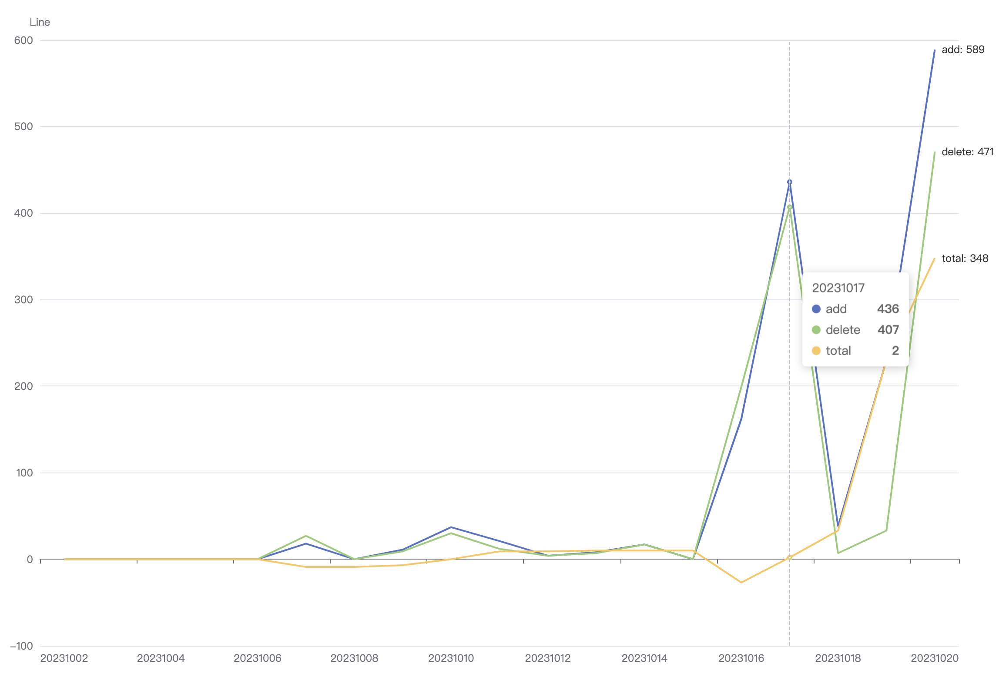

# gitchart



# How to use

```bash
gitchart help info:
  gitchart alias gitstat.
 
  run as: gitchart command
 
    -h,--help      ouput help info.
    --start        The earliest time to start the analysis.(default first git commit date)
    --end          Deadline for analysis.(default today)
    --exclude      Deadline for analysis.(default null)
    --include      Deadline for analysis.(default null)
    --cache        Analyze the cache of the file, not when the file exists.(default gitdate.json)
```

# example

```bash
$> gitchart
{}
Statistics...
service staring...
server is running at port: http://127.0.0.1:64975?start=&end=&hidden=
```

Run as options

```bash
$> gitchart -start=2023-01-01 --end=2023-10-31 exclude json       
{ start: '2023-01-01', end: '2023-10-31', exclude: 'json' }
service staring...
server is running at port: http://127.0.0.1:65496?start=&end=&hidden=
```

Save as file.
```bash
$> gitchart -start=2023-01-01 --end=2023-10-31 exclude json --output index.html  
{
  start: '2023-01-01',
  end: '2023-10-31',
  exclude: 'json',
  output: 'index.html'
}
file writen success. at $pwd/index.html
```
